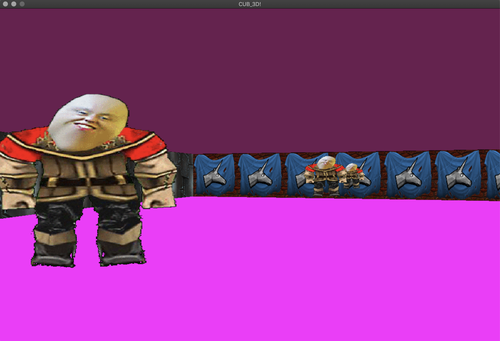

# cub3D

This project is inspired by the world-famous eponymous 90's game, Wolfenstein 3D, which was the first FPS ever. The idea was to make a dynamic view inside a maze using ray-casting. The graphics is done with the help of minilibx library. [minilibx documentation](https://harm-smits.github.io/42docs/libs/minilibx)

### Options:
* WASD to move, Left/Right directional keys to rotate camera
* Textures or colors for each sides (North, South, West, East) and Sky/Floor
* Sprites disappear when you come close enough to them
* ESC to quit (or button on the window)
* You can change parameters in the .cub file, e.g. sky/floor colour, textures, screen params

## Usage example:
`make` or `make re` to compile the project and get the executable file
`./cub3D firstmap.cub` to execute
